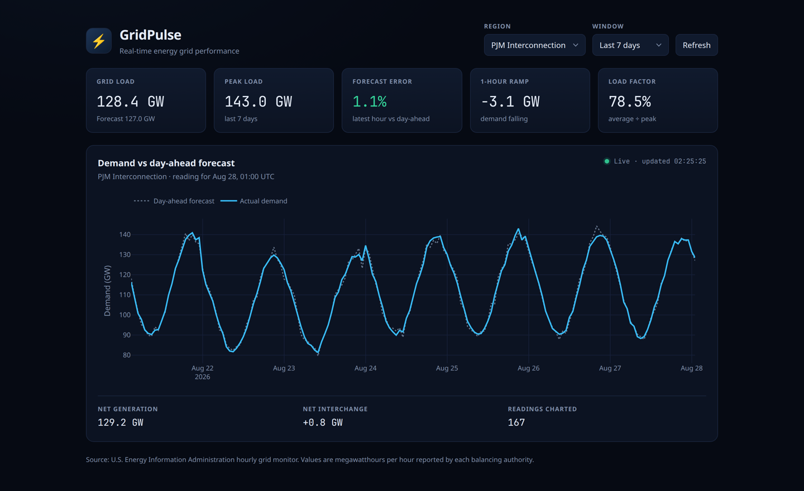

# GridPulse — Real-Time Energy Grid Performance Dashboard

GridPulse tracks how much electricity a region of the United States is using right now,
how that compares to what was forecast a day earlier, and how quickly demand is
climbing or falling. It pulls hourly readings from the U.S. Energy Information
Administration, stores them as a time series in PostgreSQL, and serves them through an
API to a dashboard.



*Seven days of demand for PJM, the grid operator covering New Jersey and twelve other
states. The screenshot uses generated sample data — see [Load some data](#3-load-some-data).*

## Contents

- [The problem it addresses](#the-problem-it-addresses)
- [What it shows](#what-it-shows)
- [How it works](#how-it-works)
- [The process: one hour of data, end to end](#the-process-one-hour-of-data-end-to-end)
- [Data model](#data-model)
- [Running it locally](#running-it-locally)
- [API](#api)
- [Design decisions](#design-decisions)
- [Tests](#tests)
- [Roadmap](#roadmap)

## The problem it addresses

Electricity is unusual among commodities: there is almost no practical way to store it at
grid scale. What gets consumed in a given hour has to be generated in that same hour.
Supply and demand must match continuously, or frequency drifts and equipment starts
tripping offline.

Keeping them matched is the job of a *balancing authority* — a regional operator such as
PJM in the mid-Atlantic or ERCOT in Texas. The day before, each one forecasts how much
electricity its region will need in every hour of tomorrow, then schedules power plants
against that forecast. When the forecast is good, the scheduled plants cover demand
cheaply. When it is wrong, the operator has to make up the difference on short notice
using whatever can respond fast, which is both expensive and closer to the reliability
margin than anyone wants to be.

That makes a few quantities genuinely diagnostic of how a grid is holding up: how far
actual demand landed from the forecast, how fast demand is moving hour to hour, and how
peaky consumption is relative to its average. GridPulse computes those from published
data and shows them together.

## What it shows

Each figure comes from the same hourly readings, so they can be read against each other.

| Reading | What it means | Why it matters |
| --- | --- | --- |
| Grid load | Electricity being consumed in the most recent reported hour | The headline number: what the region is drawing right now |
| Peak load | The highest demand in the selected window | Peaks size the whole system; capacity has to cover the worst hour, not the average |
| Forecast error | How far actual demand fell from the day-ahead forecast, as a percentage | A low number means yesterday's plan is holding. A high one means the operator is improvising |
| 1-hour ramp | Change in demand from the previous hour | Steep ramps are the hard part of grid operation — generation has to physically follow them |
| Load factor | Average demand divided by peak demand | How evenly consumption is spread. A low factor means expensive capacity sits idle most of the time |
| Net generation | Electricity generated within the region | Read against demand, it shows whether the region is producing what it consumes |
| Net interchange | Power flowing to or from neighbouring regions | Positive means the region is exporting, negative means it is leaning on its neighbours |

Six balancing authorities are tracked, selectable in the dashboard: PJM, MISO, ERCOT,
California ISO, New York ISO and ISO New England. They differ enormously in size, which
is visible immediately when switching between them — PJM runs around 128 GW while
California ISO runs around 36 GW.

Readings are hourly, because that is the resolution the source data is published at. The
dashboard refetches every minute so it picks up each new hour shortly after it appears,
but it is not a sub-second live feed and does not pretend to be.

## How it works

Four pieces, each with one job:

```
        EIA API  (hourly, per balancing authority)
           │
           ▼
   Python ingestion pipeline
   fetch → validate → transform → load
           │
           ▼
       PostgreSQL
   regions · grid_load
           │
           ▼
       FastAPI
   /api/grid/current · /history · /regions
           │
           ▼
   Next.js dashboard
   demand vs forecast · grid KPIs
```

**The pipeline** collects data. The EIA publishes hourly figures for every balancing
authority through a public API. A Python program requests a window of that data, checks
each record is well formed, reshapes it into rows, and writes it to the database. It is
safe to re-run over a window it has already collected, which is what makes it suitable
for a scheduled job.

**PostgreSQL** stores it. Two tables: one listing the regions, one holding a row per
region per hour. Keeping history rather than only the latest value is what makes peaks,
ramps and averages computable at all.

**FastAPI** answers questions about it. The dashboard never queries the database
directly; it asks the API for a region's current state or its recent history, and the API
runs the SQL. That keeps database credentials on the server, keeps the KPI definitions in
one place, and means anything else — a script, a spreadsheet, another dashboard — can use
the same endpoints.

**The Next.js dashboard** displays it. It requests the current reading and the recent
series for whichever region and time window are selected, renders the KPI cards, and
plots actual demand against the day-ahead forecast.

## The process: one hour of data, end to end

What actually happens to a single hour of grid data, from published reading to line on a
chart.

**1. The source publishes.** EIA exposes hourly figures per balancing authority as
separate records sharing a timestamp and region: demand (`D`), the day-ahead demand
forecast (`DF`), net generation (`NG`) and total interchange (`TI`). One hour of PJM is
therefore four records, not one row. The four are published on different lags, so a
freshly available hour often has demand but not yet net generation.

**2. Fetch** — `pipeline/fetch_eia.py`. One request covers every tracked region and all
four series for the whole window. EIA's query format repeats keys for multi-valued
filters, and caps a response at 5000 records, so the client builds the repeated-key query
and follows pagination using the `total` the response reports until it has everything.

**3. Validate** — `pipeline/validate.py`. Each raw record is parsed through a Pydantic
model: the timestamp becomes a timezone-aware UTC datetime, the value becomes a float or
null. Anything that fails is dropped and counted rather than raising, so one malformed
record cannot cost you the rest of the window. The run logs how many were rejected, so
silent data loss stays visible.

**4. Transform** — `pipeline/transform.py`. pandas pivots the records from one row per
series to one row per region-hour, turning those four PJM records into a single row with
four columns. Two details matter here: EIA occasionally restates an hour, so duplicates
collapse to the last value seen; and because the grouping skips nulls, a real reading is
preferred over a null one for the same slot.

**5. Load** — `pipeline/load.py`. Rows are written with an upsert keyed on
`(region_id, timestamp)`, so re-collecting a window updates existing hours instead of
duplicating them. The update coalesces each incoming value against what is already
stored, which is what stops a re-run from erasing a net generation figure that EIA had not
yet published the first time round.

**6. Query** — `kpi.py`. The API computes KPIs in SQL rather than in Python. The current
reading and its 1-hour ramp come from one query that reads only the two most recent rows
and takes the difference with a window function. Peak, average, load factor and mean
absolute forecast error come from a single aggregate over the window.

**7. Serve and render.** FastAPI returns JSON; the dashboard renders the KPI cards and
draws the two lines. Selecting a different region or window refetches both endpoints, and
a one-minute timer repeats the request so a new hour appears without a reload.

Steps 2 through 5 run as one command:

```bash
python -m gridpulse.pipeline.run --hours 48
```

Because it is idempotent, that command is safe to put on an hourly schedule.

## Data model

```
regions                      grid_load
────────                     ─────────
region_id   PK               region_id           PK, FK → regions
region_code UNIQUE           timestamp           PK  (UTC, hourly)
region_name                  actual_demand_mw        EIA series D
                             forecast_demand_mw      EIA series DF
                             net_generation_mw       EIA series NG
                             interchange_mw          EIA series TI
```

The `grid_load` primary key is ordered `(region_id, timestamp)` rather than the reverse,
so the primary key index alone satisfies the "latest N hours for one region" access
pattern that every endpoint uses, with no secondary index required.

Value columns are nullable on purpose. Because EIA publishes the four series on different
lags, a recent hour legitimately has demand and no net generation yet, and that is
different from a value of zero.

Tracked regions, by EIA respondent code: `PJM`, `MISO`, `ERCO` (ERCOT), `CISO`
(California ISO), `NYIS` (New York ISO), `ISNE` (ISO New England).

## Running it locally

### 1. PostgreSQL

```bash
createuser gridpulse --pwprompt            # password: gridpulse
createdb gridpulse --owner gridpulse
createdb gridpulse_test --owner gridpulse  # only needed to run the tests
```

### 2. Backend

```bash
cd backend
python -m venv .venv && source .venv/bin/activate
pip install -r requirements.txt
cp .env.example .env
```

### 3. Load some data

Either source works, and both write through the same loader.

**Generated sample data.** The EIA API needs a personal key, so the repository includes a
generator that produces a plausible daily demand curve — higher in the afternoon, lowest
before dawn, lighter at weekends, scaled to each region's real size:

```bash
python -m gridpulse.seed --days 7
```

Those values are **generated, not measured**. They exist so the stack runs without
credentials and so the tests have something deterministic to assert against. The
screenshot at the top of this file is generated data.

**Real EIA data.** Request a [free API key][key], put it in `backend/.env` as
`EIA_API_KEY`, then:

```bash
python -m gridpulse.pipeline.run --hours 48
```

### 4. Start the API

```bash
uvicorn gridpulse.api.main:app --reload
curl "http://localhost:8000/api/grid/current?region=PJM"
```

```json
{
  "region": "PJM",
  "region_name": "PJM Interconnection",
  "timestamp": "2026-08-28T01:00:00Z",
  "window_hours": 24,
  "demand_mw": 128009.5,
  "forecast_mw": 130886.0,
  "generation_mw": 129059.1,
  "interchange_mw": 1049.6,
  "forecast_error_pct": 2.25,
  "ramp_mw": -6534.5,
  "peak_demand_mw": 141359.8,
  "load_factor_pct": 81.64
}
```

### 5. Frontend

```bash
cd frontend
npm install
cp .env.example .env.local
npm run dev
```

Open <http://localhost:3000>.

## API

| Endpoint | Description |
| --- | --- |
| `GET /api/grid/current?region=PJM&hours=24` | Latest reading plus window KPIs |
| `GET /api/grid/history?region=PJM&hours=24` | Hourly actual-vs-forecast series |
| `GET /api/grid/regions` | Tracked balancing authorities |
| `GET /health` | Liveness plus a database round trip |

`region` accepts any tracked EIA respondent code and is case-insensitive. `hours` accepts
1–720. An unknown region returns `404` with the list of codes that are tracked; a tracked
region with no stored data returns `404` explaining how to load it.

Interactive documentation is generated at <http://localhost:8000/docs>.

## Design decisions

A few choices that shaped the implementation, and the reasoning behind them.

**Validation is non-fatal.** A malformed record is dropped and counted rather than
aborting the run. Ingesting 47 good hours out of 48 is better than ingesting none, and the
rejected count is logged so the problem is not invisible.

**Upserts coalesce instead of overwriting.** Since the four series arrive on different
lags, a naive upsert would let a later, incomplete fetch null out values already stored.
Coalescing incoming values against stored ones makes overlapping re-runs safe, which is
the property a scheduled job needs.

**KPIs live in SQL.** Peak, load factor, forecast error and ramp are all aggregate or
window operations over a time series, which is what a relational database is good at.
Computing them in the query also means the API sends small responses rather than shipping
raw rows for the client to reduce.

**The ramp query reads two rows, not the whole history.** Computing an hour-over-hour
difference with a window function over an entire region's history would scan more as data
accumulates. Ordering the primary key `(region_id, timestamp)` and limiting to the two
most recent rows keeps that query bounded no matter how much history is stored.

**The frontend has no database access.** Everything goes through the API, which keeps
credentials server-side and the KPI definitions in one place.

**Charting uses `plotly.js-dist-min` directly.** The usual React wrapper pulls in
`plotly.js` as a peer dependency and its source build; the prebuilt bundle behind a small
component avoids that, and is loaded through a dynamic import so it stays out of the
server render.

## Tests

```bash
cd backend
pytest
```

25 tests, run against a real PostgreSQL instance:

- **Pipeline tests** use a recorded EIA payload (`backend/tests/fixtures/eia_region_data.json`)
  and an injected fake HTTP session, so they need no network and no API key. They cover the
  query sent to EIA, pagination, rejection of malformed records, the pivot, restatement
  collapsing and null handling.
- **Loader tests** cover upsert idempotency, the coalescing behaviour, pandas `NaN`
  becoming SQL `NULL` rather than a float `NaN`, and untracked regions being skipped.
- **API tests** run against a seeded database, and include a tracked-but-empty region
  returning a `404` that explains how to load data.

Frontend checks:

```bash
cd frontend
npm run typecheck
npm run build
```

## Tech stack

Python · pandas · Pydantic · SQLAlchemy · PostgreSQL · FastAPI · TypeScript · React ·
Next.js · Plotly

## Roadmap

The current build covers ingestion through to the demand chart. Planned next, in order:

1. **Generation mix** — add EIA's fuel-type series and a `generation_mix` table, giving a
   renewable share figure and a breakdown of what is actually producing the power.
2. **Performance monitoring** — instrument the API with Prometheus and build Grafana
   dashboards for request latency percentiles, database query time and data freshness.
3. **Optimization** — load test with k6, then add caching and query tuning, and record the
   before-and-after difference rather than asserting an improvement.
4. **Deployment** — Docker Compose for the whole stack, CI for tests and image builds, and
   a hosted instance.
5. **Dashboard additions** — a regional map coloured by demand relative to recent peak,
   region comparison, and a feed of notable events such as unusually steep ramps.

[key]: https://www.eia.gov/opendata/register.php
